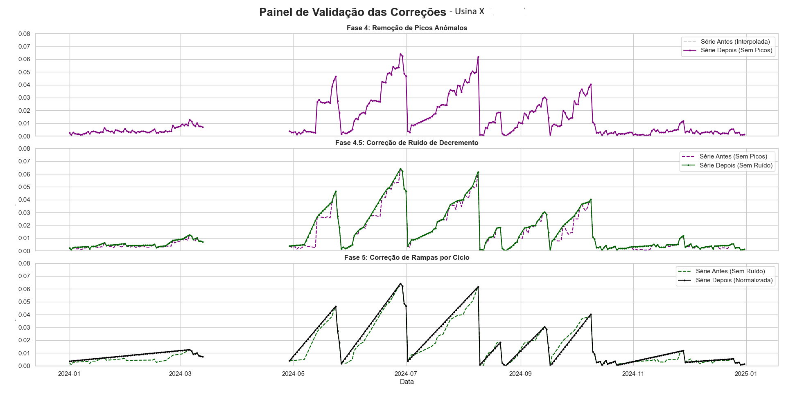
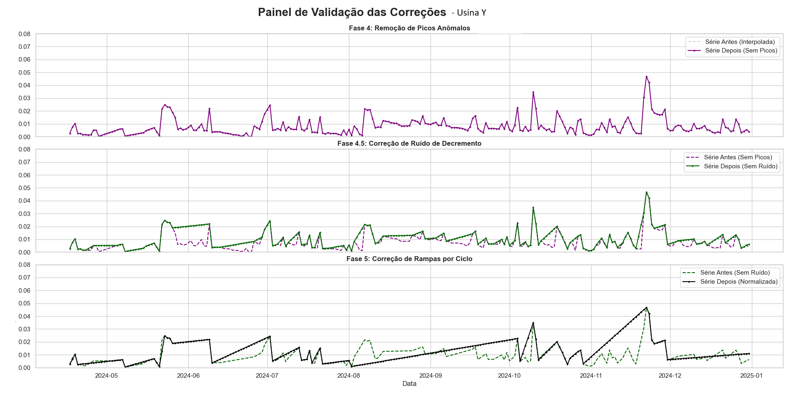
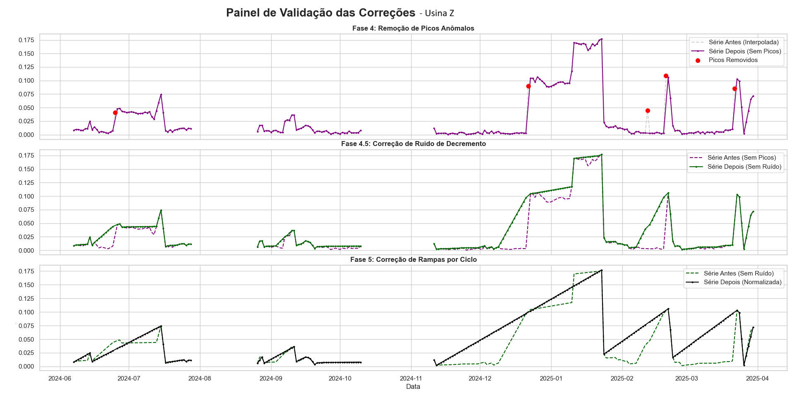

[PT-BR] Para a versão em português deste documento, role até o final da página.  

---

### **English Version**

> **⚠️ Note:** This is a case study of a data processing pipeline. For confidentiality reasons, other files are not shared.  
 

---

---

### 🎯 Project Objective

The objective of this project was to develop a robust data analysis pipeline to automate data processing and interpretation. The solution transforms raw data extracted from Excel spreadsheets into a clean and reliable series, allowing for more accurate calculations and evaluations, thereby assisting in decision-making regarding maintenance and operation.

---

### 📈 The Scenario: A Daily Operational Challenge

Manual data analysis is a complex and imprecise process. Raw data frequently contains anomalies such as:

* **Invalid Values:** Readings outside a realistic spectrum.  
* **Noise and Spikes:** Momentary fluctuations that do not represent the actual trend.  
* **Data Gaps:** Periods with reading failures or interrupted communication.  
* **Reset Events:** Sudden drops in values that "reset" the cycle and need to be handled differently.  

Manually analyzing this data is time-consuming and subjective, making it difficult to obtain a reliable daily indicator to plan operational actions.

---

### ✨ The Solution: A Python Analysis Pipeline

To solve this problem, I developed a Python script that implements a sequential and highly specialized data processing pipeline. The tool ingests the data, applies a series of statistical and heuristic corrections, and generates a final, actionable report. The technical features include:

**✅ Data Correction Pipeline:**
* Executes a sequence of 8 logical and configurable steps, where the output of one step serves as the input for the next, ensuring consistent and auditable data treatment.

**✅ Statistical Outlier Treatment:**
* Uses the trimmed mean (`scipy.stats.trim_mean`) to calculate the daily aggregated value, removing the 20% most extreme data points each day to mitigate the effect of anomalous readings.

**✅ Anomaly Detection Algorithms:**
* Implements custom logic to identify and correct data spikes that are not sustained over time, as well as small drops (noise) that do not correspond to actual system events.

**✅ Normalization by Performance Cycles:**
* The most complex stage of the pipeline: the script automatically identifies "reset events" and uses these points to segment the time series into "cycles." Within each cycle, it reconstructs a linear ramp from the beginning of the cycle to its peak, creating an idealized and clean model of the trend.

---

### 🔬 Visual Validation of the Pipeline

The graphs below are a direct output from the script's debug mode, visually demonstrating the effectiveness of the data treatment algorithms at different stages.

*
Graph 1
*

*
Graph 2
*

*
Graph 3
*

These graphs show the "before" (dashed line) and "after" (solid line) of the data at each critical phase, providing tangible proof of the pipeline's value in transforming raw, noisy data into a clean and actionable time series.

---

### 🚀 Results and Impact

The implementation of this automated pipeline generated a leap in quality and efficiency in data analysis.

| Area             | Before Automation                        | After Automation                             |
| :--------------- | :--------------------------------------- | :------------------------------------------- |
| **Data Quality** | Raw data, with noise and gaps            | Clean, corrected, and normalized time series |
| **Analysis** | Subjective and based on visual inspection | Objective and based on statistical algorithms |
| **Reliability** | Low confidence in the daily performance indicator | Calculation of a robust and defensible daily indicator |
| **Analysis Time**| Hours of manual work per analysis        | Seconds of script execution                  |

The main result was the ability to quickly and reliably generate an indicator, allowing for better operational planning.

---

### 💡 Skills and Competencies Demonstrated

* **Data Engineering:** Design and implementation of an ETL (Extract, Transform, Load) and data processing pipeline.  
* **Statistical Data Analysis:** Advanced use of `pandas`, `numpy`, and `scipy` libraries for cleaning, transformation, interpolation, and statistical analysis.  
* **Algorithm Development:** Creation of custom heuristics and algorithms for anomaly detection and time series normalization.  
* **Python Development:** Structuring a modular, parameterized, and well-practiced script for maintainability.  

---
---
---

### **Versão em Português**

> **⚠️ Observação:** Este é um case study de um pipeline de processamento de dados. Por motivos de confidencialidade, os demais arquivos não são compartilhados.

---

---
### 🎯 Objetivo do Projeto

O objetivo deste projeto foi desenvolver um pipeline de análise de dados robusto para automatizar o processamento e a interpretação de dados. A solução trata dados brutos extraídos de planilhas Excel, em uma série limpa e confiável, permitindo o cálculos e avaliações mais precisas, auxiliando na tomada de decisões sobre manutenção e operação.

---

### 📈 O Cenário: Um Desafio Operacional Diário

A análise manual de dados é um processo complexo e impreciso. Os dados brutos frequentemente contêm anomalias como:

* **Valores Inválidos:** Leituras fora de um espectro realista.  
* **Ruído e Picos:** Flutuações momentâneas que não representam a tendência real.  
* **Lacunas de Dados:** Períodos com falha de leituras ou comunicação interrompida.  
* **Eventos de Reset:** Quedas bruscas nos valores que "resetam" o ciclo e precisam ser tratadas de forma distinta.  

A análise manual desses dados é demorada e subjetiva, dificultando a obtenção de um indicador diário confiável para planejar as ações operacionais.

---

### ✨ A Solução: Um Pipeline de Análise em Python

Para resolver este problema, desenvolvi um script em Python que implementa um pipeline de processamento de dados sequencial e altamente especializado. A ferramenta ingere os dados, aplica uma série de correções estatísticas e heurísticas, e gera um relatório final acionável. Os recursos técnicos incluem:

**✅ Pipeline de Correção de Dados:**
* Executa uma sequência de 8 etapas lógicas e configuráveis, onde a saída de uma etapa serve como entrada para a próxima, garantindo um tratamento de dados consistente e auditável.

**✅ Tratamento Estatístico de Outliers:**
* Utiliza a média aparada (`scipy.stats.trim_mean`) para calcular o valor diário agregado, removendo os 20% de dados mais extremos de cada dia para mitigar o efeito de leituras anômalas.

**✅ Algoritmos de Detecção de Anomalias:**
* Implementa lógicas customizadas para identificar e corrigir picos de dados que não se sustentam ao longo do tempo, bem como pequenas quedas (ruídos) que não correspondem a eventos de sistema reais.

**✅ Normalização por Ciclos de Performance:**
* A etapa mais complexa do pipeline: o script identifica automaticamente "eventos de reset" e usa esses pontos para segmentar a série temporal em "ciclos". Dentro de cada ciclo, ele reconstrói uma rampa linear, do início do ciclo até seu pico, criando um modelo idealizado e limpo da tendência.

---

### 🔬 Validação Visual do Pipeline

Os gráficos abaixo são uma saída direta do modo de depuração do script, demonstrando visualmente a eficácia dos algoritmos de tratamento de dados em diferentes fases.

*
Gráfico 1
*

*
Gráfico 2
*

*
Gráfico 3
*

Estes gráficos mostram o "antes" (linha tracejada) e o "depois" (linha sólida) dos dados em cada fase crítica, fornecendo uma prova tangível do valor do pipeline ao transformar dados brutos e ruidosos em uma série temporal limpa e acionável.

---

### 🚀 Resultados e Impacto

A implementação deste pipeline automatizado gerou um salto de qualidade e eficiência na análise dos dados.

| Área                  | Antes da Automação                       | Depois da Automação                            |
| :-------------------- | :--------------------------------------- | :--------------------------------------------- |
| **Qualidade dos Dados** | Dados brutos, com ruídos e lacunas       | Série temporal limpa, corrigida e normalizada  |
| **Análise** | Subjetiva e baseada em inspeção visual   | Objetiva e baseada em algoritmos estatísticos  |
| **Confiabilidade** | Baixa confiança no indicador de performance diário | Cálculo de um indicador diário robusto e defensável |
| **Tempo de Análise** | Horas de trabalho manual por análise     | Segundos de execução do script                 |

O principal resultado foi a capacidade de gerar, de forma rápida e confiável, um indicador, permitindo um melhor planejamento operacional.

---

### 💡 Habilidades e Competências Demonstradas

* **Engenharia de Dados:** Concepção e implementação de um pipeline de ETL (Extração, Transformação e Carga) e processamento de dados.  
* **Análise Estatística de Dados:** Uso avançado das bibliotecas `pandas`, `numpy` e `scipy` para limpeza, transformação, interpolação e análise estatística.  
* **Desenvolvimento de Algoritmos:** Criação de heurísticas e algoritmos customizados para detecção de anomalias e normalização de séries temporais.  
* **Desenvolvimento em Python:** Estruturação de um script modular, parametrizado e com boas práticas para manutenção.  
